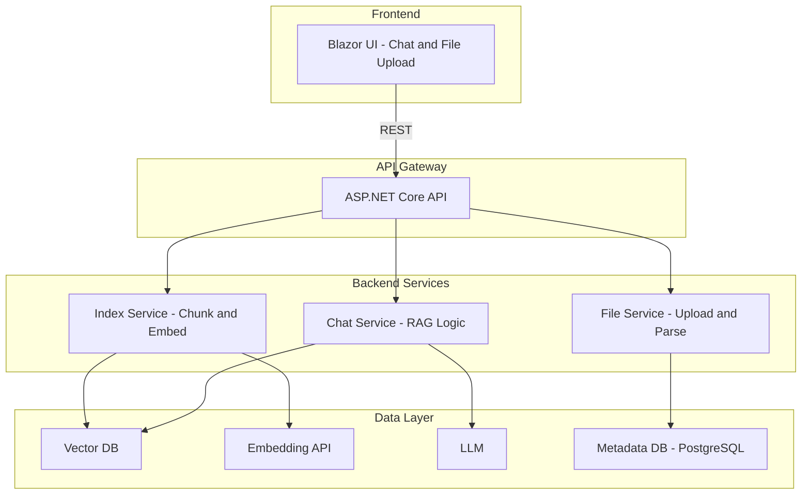

# Kế hoạch Triển khai Kiến trúc RAG

## Hiện trạng và Kiến trúc Mục tiêu

Dự án của bạn có **AIFE** (Blazor) và **AIBE** (ASP.NET Core API) là các ứng dụng riêng biệt, chưa được kết nối. Kiến trúc mục tiêu bổ sung ba dịch vụ miền phía sau API gateway, cùng với Vector DB, LLM và PostgreSQL.




---

## Quyết định Kiến trúc


| Quyết định              | Khuyến nghị                                                                                                                                 |
| ----------------------- | -------------------------------------------------------------------------------------------------------------------------------------------- |
| **Bố cục dịch vụ**      | Bắt đầu với **API monolithic** (một dự án AIBE duy nhất) với các module Chat/Index/File rõ ràng. Tách thành các dịch vụ riêng sau nếu cần.   |
| **Vector DB**           | Dùng **Qdrant** hoặc **pgvector** (tiện ích PostgreSQL) để giữ hạ tầng đơn giản hơn.                                                         |
| **Embedding API**       | Dùng **OpenAI embeddings** hoặc **Azure OpenAI**; ẩn phía sau một interface.                                                              |
| **LLM**                 | Dùng **OpenAI** hoặc **Azure OpenAI** cho chat completion.                                                                                   |
| **Phân tích file**      | Dùng **iTextSharp** / **PdfPig** cho PDF, các kiểu tích hợp sẵn cho định dạng phổ biến.                                                      |


---

## Giai đoạn 1: Nền tảng (API Gateway + Cấu hình)

**Mục tiêu:** AIBE trở thành API gateway; AIFE gọi nó qua HTTP.

- Thêm CORS trong AIBE cho origin của AIFE.
- Cấu hình `HttpClient` trong AIFE để gọi base URL của AIBE (ví dụ `http://localhost:5014`).
- Thêm mục trong `appsettings` cho: API key OpenAI/Azure, PostgreSQL, Vector DB và mọi endpoint embedding/LLM.
- Thêm dự án/thư mục contracts/DTO dùng chung cho các mô hình request/response giữa AIFE và AIBE.

**File:** `[AIBE/Program.cs](d:\AIProject\AIBE\Program.cs)`, `[AIFE/Program.cs](d:\AIProject\AIFE\Program.cs)`, `[AIBE/appsettings.json](d:\AIProject\AIBE\appsettings.json)`.

---

## Giai đoạn 2: File Service + Metadata DB

**Mục tiêu:** Tải lên và lưu file kèm metadata trong PostgreSQL.

- Thêm **EF Core** và **Npgsql** vào AIBE.
- Định nghĩa entity: `Document` (Id, FileName, ContentType, UploadedAt, ChunkCount, Status).
- Thêm `FileService` với: upload, parse (trích xuất văn bản) và lưu metadata.
- Thêm endpoint `FileController`, ví dụ:
  - `POST /files` — multipart upload.
  - `GET /files` — liệt kê tài liệu.
  - `GET /files/{id}` — metadata và nội dung (tùy chọn).

**Mới:** Migrations, `Services/FileService.cs`, `Controllers/FileController.cs`.

---

## Giai đoạn 3: Index Service (Chunk + Embed)

**Mục tiêu:** Chia tài liệu thành chunk, embed qua API, lưu vector.

- Thêm **text-splitting** (ví dụ semantic chunking hoặc kích thước cố định có overlap).
- Tích hợp **Embedding API** (OpenAI/Azure) phía sau `IEmbeddingService`.
- Thêm client **Vector DB** (Qdrant hoặc pgvector).
- Triển khai `IndexService`:
  - Nhận document ID, đọc văn bản từ File Service.
  - Chunk → Embed → Lưu vào Vector DB.
  - Cập nhật metadata tài liệu (ChunkCount, Status).
- Thêm `IndexController`, ví dụ `POST /index/{documentId}` để kích hoạt indexing.

---

## Giai đoạn 4: Chat Service (RAG)

**Mục tiêu:** Truy vấn RAG: lấy chunk liên quan, gửi cho LLM, trả về câu trả lời.

- Triển khai `RagService`:
  1. Embed câu hỏi của người dùng.
  2. Tìm kiếm vector top-k chunk.
  3. Xây dựng prompt với context đã lấy + tin nhắn người dùng.
  4. Gọi LLM (OpenAI/Azure) để completion.
  5. Trả về câu trả lời (và tùy chọn trích dẫn nguồn).
- Thêm `ChatController`, ví dụ `POST /chat` với `{ "message": "..." }`.
- Tùy chọn thêm streaming cho phản hồi thời gian thực.

---

## Giai đoạn 5: Blazor UI (Chat + File Upload)

**Mục tiêu:** Chat UI và upload file được kết nối với AIBE.

- **Chat:**
  - Thêm trang Chat (ví dụ `Pages/Chat.razor`) với danh sách tin nhắn và ô nhập.
  - Gọi `POST /chat` qua `HttpClient`; tùy chọn hiển thị trích dẫn/nguồn.
- **File upload:**
  - Thêm trang Files (ví dụ `Pages/Files.razor`) với form upload và danh sách tài liệu.
  - Gọi `POST /files` và `GET /files`.
  - Thêm hành động "Index" cho từng tài liệu gọi `POST /index/{id}`.
- Cập nhật NavMenu với liên kết tới Chat và Files.

---

## Cấu trúc Dự án Đề xuất (sau khi triển khai)

```
AIBE/
├── Controllers/
│   ├── ChatController.cs
│   ├── FileController.cs
│   └── IndexController.cs
├── Services/
│   ├── FileService.cs
│   ├── IndexService.cs
│   └── RagService.cs
├── Data/
│   ├── AppDbContext.cs
│   └── Entities/
├── Contracts/
│   └── DTOs/
├── Infrastructure/
│   ├── IEmbeddingService.cs
│   └── IVectorStore.cs
```

---

## Các phụ thuộc cần thêm


| Package                               | Mục đích                          |
| ------------------------------------- | --------------------------------- |
| Npgsql.EntityFrameworkCore.PostgreSQL | PostgreSQL + EF Core              |
| Microsoft.EntityFrameworkCore.Design  | Migrations                        |
| OpenAI / Azure.AI.OpenAI              | Embeddings + chat completion      |
| Qdrant.Client hoặc pgvector           | Tìm kiếm vector                   |
| PdfPig / iText7 (nếu cần)             | Phân tích PDF                     |


---

## Các câu hỏi cần làm rõ (trước khi triển khai)

1. **Lựa chọn Vector DB:** Qdrant (dịch vụ riêng) hay pgvector (tiện ích PostgreSQL)?
2. **Nhà cung cấp LLM/Embedding:** OpenAI hay Azure OpenAI hay cả hai (có thể cấu hình)?
3. **Streaming:** Phản hồi chat có nên stream từng token không?
4. **Auth:** Có yêu cầu xác thực/ủy quyền không?
