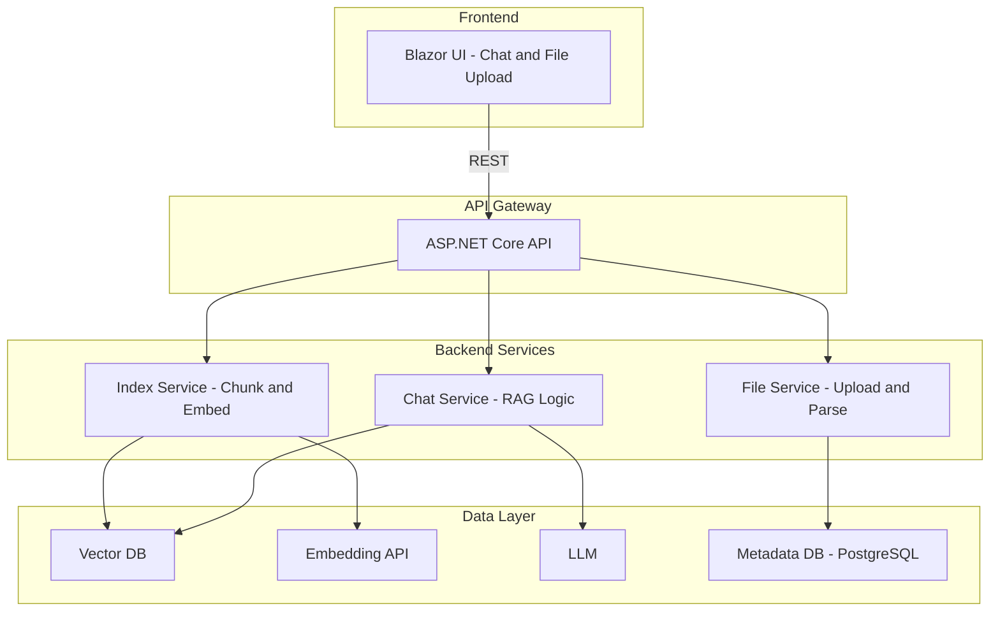

# RAG Architecture Implementation Plan

## Current State vs Target Architecture

Your project has **AIFE** (Blazor) and **AIBE** (ASP.NET Core API) as separate, unwired apps. The target architecture adds three domain services behind an API gateway, plus Vector DB, LLM, and PostgreSQL.




---

## Architectural Decisions


| Decision           | Recommendation                                                                                                                        |
| ------------------ | ------------------------------------------------------------------------------------------------------------------------------------- |
| **Service layout** | Start with **monolithic API** (single AIBE project) with clear Chat/Index/File modules. Split into separate services later if needed. |
| **Vector DB**      | Use **Qdrant** or **pgvector** (PostgreSQL extension) to keep infrastructure simpler.                                                 |
| **Embedding API**  | Use **OpenAI embeddings** or **Azure OpenAI**; abstract behind an interface.                                                          |
| **LLM**            | Use **OpenAI** or **Azure OpenAI** for chat completion.                                                                               |
| **File parsing**   | Use **iTextSharp** / **PdfPig** for PDFs, built-in types for common formats.                                                          |


---

## Phase 1: Foundation (API Gateway + Config)

**Goal:** AIBE becomes the API gateway; AIFE calls it over HTTP.

- Add CORS in AIBE for AIFE origin.
- Configure `HttpClient` in AIFE to call AIBE base URL (e.g. `http://localhost:5014`).
- Add `appsettings` entries for: OpenAI/Azure API keys, PostgreSQL, Vector DB, and any embedding/LLM endpoints.
- Add a shared contracts/DTO project (or folder) for request/response models between AIFE and AIBE.

**Files:** `[AIBE/Program.cs](d:\AIProject\AIBE\Program.cs)`, `[AIFE/Program.cs](d:\AIProject\AIFE\Program.cs)`, `[AIBE/appsettings.json](d:\AIProject\AIBE\appsettings.json)`.

---

## Phase 2: File Service + Metadata DB

**Goal:** Upload and store files with metadata in PostgreSQL.

- Add **EF Core** and **Npgsql** to AIBE.
- Define entities: `Document` (Id, FileName, ContentType, UploadedAt, ChunkCount, Status).
- Add `FileService` with: upload, parse (text extraction), and metadata persistence.
- Add `FileController` endpoints, e.g.:
  - `POST /files` — multipart upload.
  - `GET /files` — list documents.
  - `GET /files/{id}` — metadata and optional content.

**New:** Migrations, `Services/FileService.cs`, `Controllers/FileController.cs`.

---

## Phase 3: Index Service (Chunk + Embed)

**Goal:** Chunk documents, embed via API, store vectors.

- Add **text-splitting** (e.g. semantic chunking or fixed-size with overlap).
- Integrate **Embedding API** (OpenAI/Azure) behind `IEmbeddingService`.
- Add **Vector DB** client (Qdrant or pgvector).
- Implement `IndexService`:
  - Accept document ID, read text from File Service.
  - Chunk → Embed → Store in Vector DB.
  - Update document metadata (ChunkCount, Status).
- Add `IndexController`, e.g. `POST /index/{documentId}` to trigger indexing.

---

## Phase 4: Chat Service (RAG)

**Goal:** RAG queries: retrieve relevant chunks, send to LLM, return answers.

- Implement `RagService`:
  1. Embed user query.
  2. Vector search for top-k chunks.
  3. Build prompt with retrieved context + user message.
  4. Call LLM (OpenAI/Azure) for completion.
  5. Return answer (and optionally citations).
- Add `ChatController`, e.g. `POST /chat` with `{ "message": "..." }`.
- Optionally add streaming for real-time responses.

---

## Phase 5: Blazor UI (Chat + File Upload)

**Goal:** Chat UI and file upload wired to AIBE.

- **Chat:**
  - Add Chat page (e.g. `Pages/Chat.razor`) with message list and input.
  - Call `POST /chat` via `HttpClient`; optionally show citations/sources.
- **File upload:**
  - Add Files page (e.g. `Pages/Files.razor`) with upload form and document list.
  - Call `POST /files` and `GET /files`.
  - Add “Index” action per document calling `POST /index/{id}`.
- Update `NavMenu` with links to Chat and Files.

---

## Suggested Project Structure (after implementation)

```
AIBE/
├── Controllers/
│   ├── ChatController.cs
│   ├── FileController.cs
│   └── IndexController.cs
├── Services/
│   ├── FileService.cs
│   ├── IndexService.cs
│   └── RagService.cs
├── Data/
│   ├── AppDbContext.cs
│   └── Entities/
├── Contracts/
│   └── DTOs/
├── Infrastructure/
│   ├── IEmbeddingService.cs
│   └── IVectorStore.cs
```

---

## Dependencies to Add


| Package                               | Purpose                      |
| ------------------------------------- | ---------------------------- |
| Npgsql.EntityFrameworkCore.PostgreSQL | PostgreSQL + EF Core         |
| Microsoft.EntityFrameworkCore.Design  | Migrations                   |
| OpenAI / Azure.AI.OpenAI              | Embeddings + chat completion |
| Qdrant.Client or pgvector             | Vector search                |
| PdfPig / iText7 (if needed)           | PDF parsing                  |


---

## Open Questions (to confirm before implementation)

1. **Vector DB choice:** Qdrant (separate service) vs pgvector (PostgreSQL extension)?
2. **LLM/Embedding provider:** OpenAI vs Azure OpenAI vs both (configurable)?
3. **Streaming:** Should chat responses stream token-by-token?
4. **Auth:** Any authentication/authorization requirements?

